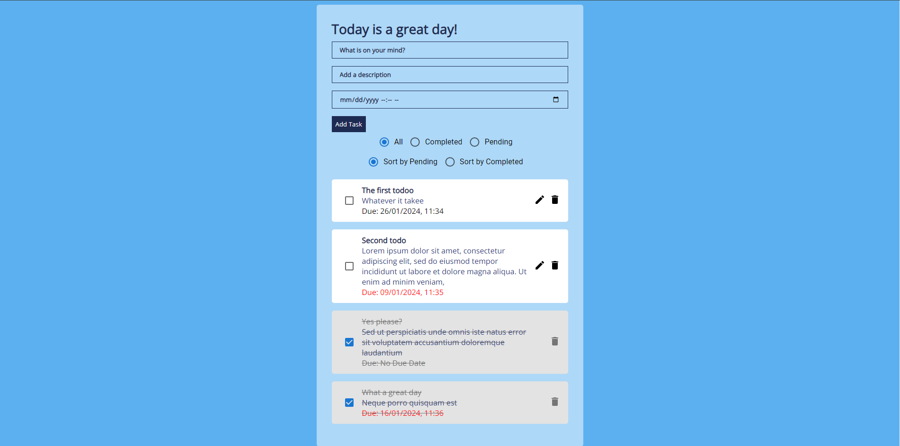

# Introduction
This Todo app allow user to create, edit, delete and rearrange Todos in the list. A due date function is also implemented for the usability of the web.

# How to run this project
There are two ways to run this project, either as development or production. Also, requirement is needed to run this project.
## Requirements
Node.js installed

## Steps to run
1. First run `npm install` to install all dependencies
### Run as development env
1. To run project in dev enc, `npm start` to start the project

### Running as Production
1. `npm run build` to build the project
2. `serve -s build` to start the project

For better performance, running as production is recommended